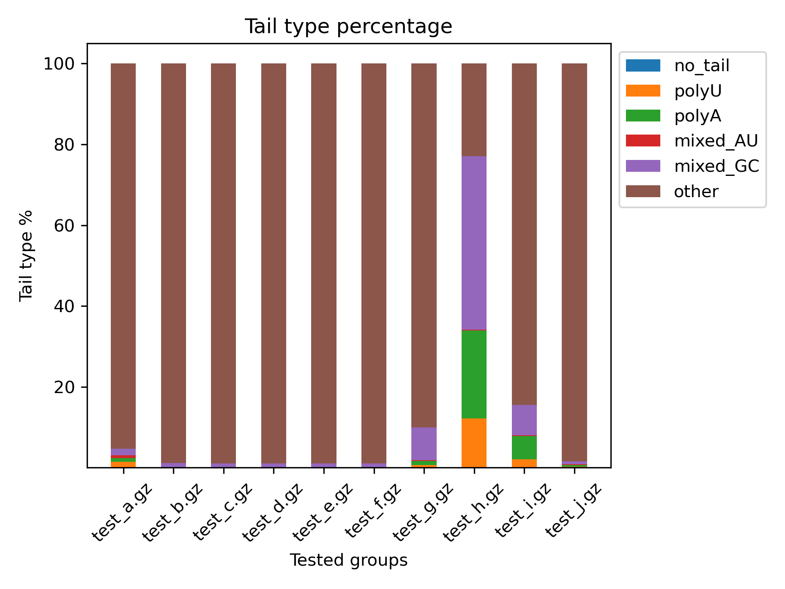
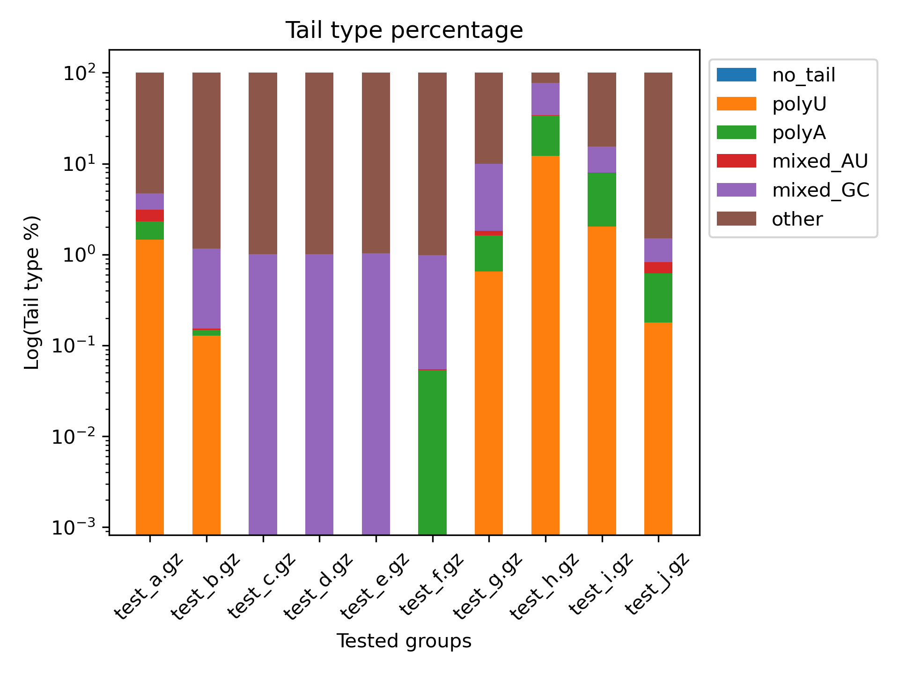

# Slipper

Tool for basic soft clip 3' RNA tail analysis.

## Dependencies

* pysam

# Installation

Run:

```
git clone https://github.com/MHryc/Slipper.git
cd Slipper/
chmod +x Slipper slipper.py # just in case, should not be necessary
```

`Slipper` is just a symlink to `slipper.py`. You might want to create another
one in your `$PATH`, eg. `~/.local/bin` for easier access.

# Usage

```
usage: Slipper [-h] {extract,analyse} ...

Extract soft clipped bases from BAM. For output description see repo's README.md

positional arguments:
  {extract,analyse}
    extract          Extract soft clipped bases from BAM
    analyse          Analyse the output of 'Slipper extract'

options:
  -h, --help         show this help message and exit

usage: Slipper extract [-h] -i INPUT -o OUTPUT [-g] [-c LEVEL] [-s]

options:
  -h, --help            show this help message and exit
  -i INPUT, --input INPUT
                        Path to the input BAM file (needs an index)
  -o OUTPUT, --output OUTPUT
                        Path to the output file (without file extensions)
  -g, --gzip            Output to gzip compressed file
  -c LEVEL, --compress-level LEVEL
                        Gzip compression level (default=2)
  -s, --with-sequence   Store the whole read sequence (SEQ) in the last column. Default is off (fill with "NA")

usage: Slipper analyse [-h] -i INPUT [--short-output] -o OUTPUT

options:
  -h, --help            show this help message and exit
  -i INPUT, --input INPUT
                        Path to the input TSV produced by 'Slipper extract'
  --short-output        Skip the lines with 'no_tail' in the output
  -o OUTPUT, --output OUTPUT
                        Path to the output file (without file extensions)
```

# Example run

```
# Extract soft clipped bases from BAM, save to soft_clips.tsv.gz
Slipper extract -g -i reads.bam -o soft_clips

# Analyse extracted soft clips, omit rows assigned the "no_tail" tail type
# (--short-output). Output to tails.tsv.gz
Slipper analyse -i tails.tsv.gz --short-output -o tails

# Create plots from tails.tsv.gz data, save to plots/ directory
Slipper plot -i tails.tsv.gz -o plots
```

## Output plots

Linear Y scale plot



Base 10 Log Y scale plot



# Output formats

## `Slippter extract`

| name  | description                                                                   |
| ---   | ---                                                                           |
| QNAME | Query template NAME                                                           |
| FLAGS | bitwise FLAG both as int and 12-bit                                           |
| RNAME | Reference sequence NAME                                                       |
| POS   | 0-based leftmost tail POSition, i.e. the 1st base AFTER the last aligned base |
| CLIP5 | 5' soft clipped SEQuence (NA if not present)                                  |
| CLIP3 | 3' soft clipped SEQuence (NA if not present)                                  |
| SEQ   | segment SEQuence (read sequence, optional, filled with NA if not set          | 

### Example output

```
QNAME   FLAGS   RNAME   POS     CLIP5   CLIP3   SEQ
A00805:128:H5W25DRX2:1:2242:1190:26882  163:000010100011        1       15161   TTAATAGGAACTCATGTC      NA      TTAATAGGAACTCATGTCAGCCTCAGTCGATCCCTGACCCAGCACCGGGCACTGATGAGACAGCGGCGGTTTGAGGAGCCACCTCCCAGCCACCTCGGGGC
A00805:128:H5W25DRX2:2:2263:27462:7842  419:000110100011        1       15274   TGCATAATGAAAAGCGTCAGG   NA      TGCATAATGAAAAGCGTCAGGATGGGGAAACTGGCCCAGAGAGGTGAGGCAGCTTGCCTGGGGTCACAGAGCAAGGCAAAAGCAGCGCTGGGTACAAGCTC
A00805:128:H5W25DRX2:1:2242:1190:26882  83:000001010011 1       15281   NA      NA      AACTGGCCCAGAGAGGTGAGGCAGCTTGCCTGGGGTCACAGAGCAAGGCAAAAGCAGCGCTGGGTACAAGCTCAAAACCATAGTGCCCAGGGCACTGCCGC
A00805:128:H5W25DRX2:2:2263:27462:7842  339:000101010011        1       15338   NA      NA      CGCTGGGTACAAGCTCAAAACCATAGTGCCCAGGGCACTGCCGCTGCAGGCGCAGGCATCGCATCACACCAGTGTCTGCGTTCACAGCAGGCATCATCAGT
A00805:128:H5W25DRX2:2:1169:26775:16924 419:000110100011        1       17055   GAGTACGATGTGGTAGTCAGT   NA      GAGTACGATGTGGTAGTCAGTCTGCAAGATTAGGCAGGGACATGTGAGAGGTGACAGGGACCTGCAGGGGCAGCCAACAAGACCTTGTGTGCACCTCCCAT
A00805:128:H5W25DRX2:2:1169:26775:16924 339:000101010011        1       17131   NA      NA      CCATGGGTGGAATAAGGGGCCCAACAGCCTTGACTGGAGAGGAGCTCTGGCAAGGCCCTGGGCCACTGCACCTGTCTCCACCTCTGTCCCACCCCTCCCAC
A00805:128:H5W25DRX2:1:1106:17463:27101 419:000110100011        1       17611   CTTGATACTATATAAGTCAGTGGAAAAAA   NA      CTTGATACTATATAAGTCAGTGGAAAAAATCGGTGGTGTTGAAGAGCAGCAAGGAGCTGACAGAGCTGATGTTGCTGGGAAGACCCCCAAGTCCCTCTTCT
A00805:128:H5W25DRX2:2:2263:18611:10207 419:000110100011        1       22662   GTGACAATGGTAAGGGTCAG    NA      GTGACAATGGTAAGGGTCAGGGCCCTCCCTGGGCTGTGCCAGCAGCTTGGAGAACCCACACTCAATGAACGCAGCACTCCACTACCCAGGAAATGCCTTCC
A00805:128:H5W25DRX2:2:2263:18069:16939 419:000110100011        1       22662   GTGACAATGGTAAGGGTCAG    NA      GTGACAATGGTAAGGGTCAGGGCCCTCCCTGGGCTGTGCCAGCAGCTTGGAGAACCCACACTCAATGAACGCAGCACTCCACTACCCAGGAAATGCCTTCC
```

## `Slipper analyse`


| name     | description                                                                   |
| ---      | ---                                                                           |
| QNAME    | Query template NAME                                                           |
| FLAGS    | bitwise FLAG both as int and 12-bit                                           |
| RNAME    | Reference sequence NAME                                                       |
| POS      | 0-based leftmost tail POSition, i.e. the 1st base AFTER the last aligned base |
| CLIP5    | 5' soft clipped SEQuence (NA if not present)                                  |
| CLIP3    | 3' soft clipped SEQuence (NA if not present)                                  |
| SEQ      | segment SEQuence (read sequence, optional, filled with NA if not set          | 
| TAIL_LEN | length of the 3' soft clip                                                    |
| A        | number of adenines in the tail                                                |
| C        | number of citosines in the tail                                               |
| G        | number of guanines in the tail                                                |
| U        | number of thymines/uracils in the tail                                        |
| STRAND   | mapping strand, can be 1 or -1 (equivalent to + and -)                        |
| TYPE     | 3' tail type (no_tail, polyU, polyA, mixed_AU, mixed_GC, other)               |
| U_COUNT  | number of consecutive 3' terminal uracils                                     |

### Example output

```
QNAME   FLAGS   RNAME   POS     CLIP5   CLIP3   SEQ     TAIL_LEN        A       C       G       U       STRAND  TYPE    U_COUNT
A00805:128:H5W25DRX2:1:1104:17137:6809  403:000110010011        1       36600   NA      TACGGGAGGGGTGACAGGAA    NA      20      6       2       10      2       -1      other   0
A00805:128:H5W25DRX2:1:1237:30680:4554  355:000101100011        1       389344  NA      TTTTTGGAGCACTTTCTTCC    NA      20      2       5       3       10      -1      other   0
A00805:128:H5W25DRX2:2:1167:25861:18443 355:000101100011        1       389344  NA      TTTTTGGAGCACTTTCTTCC    NA      20      2       5       3       10      -1      other   0
A00805:128:H5W25DRX2:1:1237:30680:4554  403:000110010011        1       389344  NA      TTTTTGGAGCACTTTCTTCC    NA      20      2       5       3       10      -1      other   0
A00805:128:H5W25DRX2:2:1167:25861:18443 403:000110010011        1       389344  NA      TTTTTGGAGCACTTTCTTCC    NA      20      2       5       3       10      -1      other   0
A00805:128:H5W25DRX2:1:1237:30680:4554  99:000001100011 1       619234  NA      TTTTTGGAGCACTTTCTTCC    NA      20      2       5       3       10      -1      other   0
A00805:128:H5W25DRX2:2:1167:25861:18443 99:000001100011 1       619234  NA      TTTTTGGAGCACTTTCTTCC    NA      20      2       5       3       10      -1      other   0
A00805:128:H5W25DRX2:1:1237:30680:4554  147:000010010011        1       619234  NA      TTTTTGGAGCACTTTCTTCC    NA      20      2       5       3       10      -1      other   0
A00805:128:H5W25DRX2:2:1167:25861:18443 147:000010010011        1       619234  NA      TTTTTGGAGCACTTTCTTCC    NA      20      2       5       3       10      -1      other   0
```
